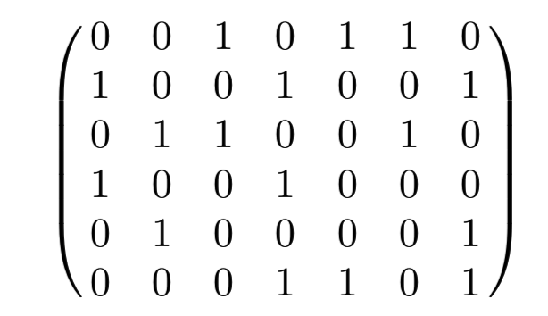
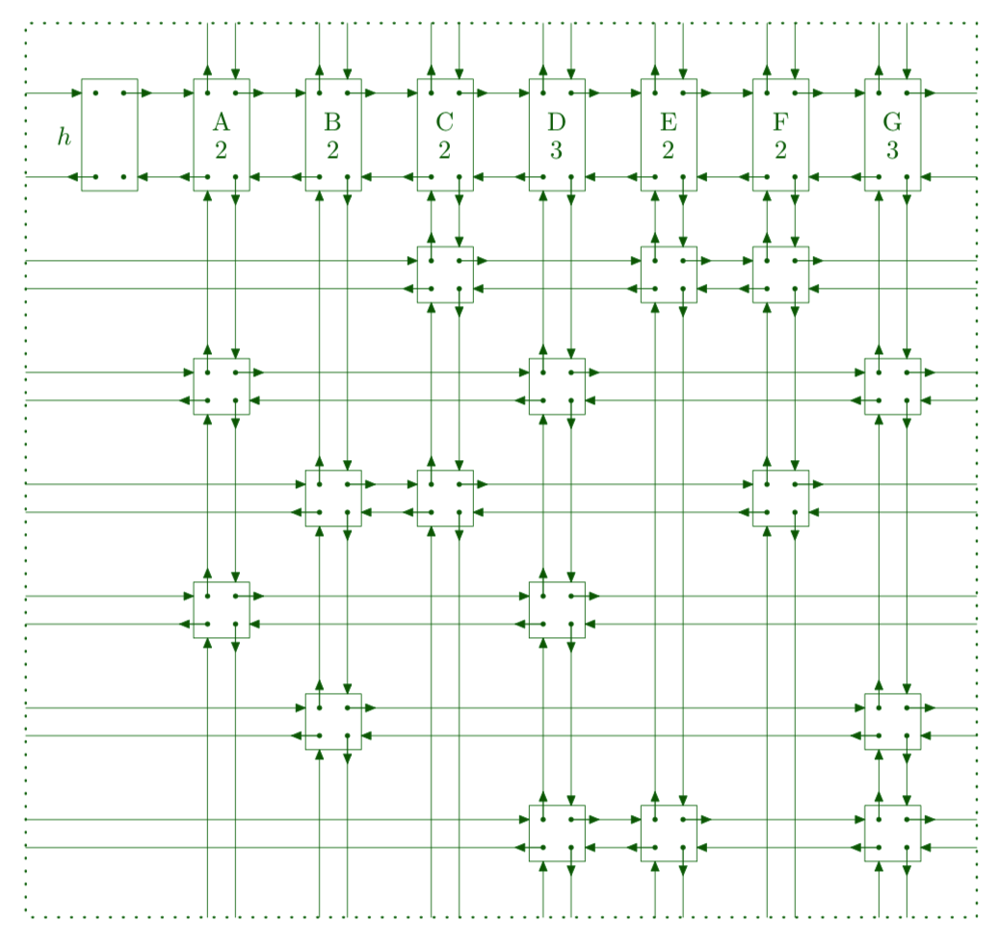

### Dancing Links 

Dancing Links是一个用于解决一类问题的高效数据结构。本质是一个十字链表，下面是一个示意图。

用十字链表来存储稀疏矩阵。

下面是一个矩阵的结构示意图。





在求解精确覆盖问题的时候使用的是爆搜的算法。

首先我们选择一行，得到的结果是怎么样的。

如上，我么选择第二行，则需要对矩阵进行如下的操作。

1. 第二行已经包含了第一列，第四列还有第七列的1，所以我们需要将这些列从矩阵中删除。
2. 在删除某一列的时候，我们需要将这一列包含1的行删除，如第一列中第四行也是1，所以第四行不能选了，我们需要将第四行中的所有元素都删除。

所以选择了一行的话，需要对矩阵中的**若干行和若干列**进行删除。

所以我们定义如下的删除列的操作：

```txt
删除列p:
	1. 将这一列从矩阵中删除，这一个操作可以直接将列的头结点从第一行的结点中删除
	2. 将这一列中1对应的行删除，删除行元素只需要将这个元素从其所在的列总删除即可。
```

所以所有的删除操作是不会修改除了哨兵元素的每一行之间的关系的。这便于我们回溯的时候恢复十字链表。

下面是十字链表的几个关键函数的实现。

#### 构造

相当于采用链表的头插法来对整个十字链表进行构造。

```c++
    //!! 构造函数，接收一个bool类型的矩阵，以及矩阵中最大的1的个数
    explicit DancingLinks(const vector<vector<bool>> &_matrix,  int _max_nodes) :
            cols(_matrix[0].size()),
            data(vector<Node>(_max_nodes)),
            col_size(vector<int>(_matrix[0].size() + 1)),
            free_idx(cols + 1) {
        // 初始化哨兵表头
        for (int i = 0; i <= cols; i ++) {
            data[i].left = i - 1;
            data[i].right = i + 1;
            data[i].up = data[i].down = i;
        }
        data[0].left = cols;
        data[cols].right = 0;
        _init_with_matrix(_matrix);
    }

    // 初始化函数，
    void _init_with_matrix(const vector<vector<bool>> &_matrix) {
        int n = _matrix.size(), m = _matrix[0].size();
        for (int i = n - 1; i >= 0; i --) { // 行元素逆过来遍历
            int head = free_idx, tail = free_idx;
            for (int j = 0; j < m; j ++) {  // 列元素正常遍历
                if (_matrix[i][j]) {
                    _insert(head, tail, i + 1, j + 1);
                }
            }
        }
    }

   // 插入函数
    void _insert(int &head, int &tail, int x, int y) {
        data[free_idx].col = y;
        data[free_idx].row = x;
        data[free_idx].left = tail;
        data[free_idx].right = head;
        data[free_idx].up = y;
        data[free_idx].down = data[y].down;
        data[data[free_idx].left].right = free_idx;
        data[data[free_idx].right].left = free_idx;
        data[data[free_idx].up].down = free_idx;
        data[data[free_idx].down].up = free_idx;
        col_size[y] ++;
        tail = free_idx ++;
    }
```

#### 求解的过程

在求解的过程中，采用了如下的爆搜优化：

1. 优先枚举包含1少的列，这样可以保证当前分支最少。通过维护一个数组记录每一列中1的个数

```c++
    // 求解函数
    bool _solve() {

        if (_empty()) return true;
        int p = get_min_one_column();
        _remove(p);
        for (int i = data[p].down; i != p; i = data[i].down) {  // 枚举当前列中包含一的每一行

            one_solution.push_back(data[i].row);
            for (int j = data[i].right; j != i; j = data[j].right) _remove(data[j].col);  // 将这一行中包含一的对应列都删除
            if (_solve()) return true;
            for (int j = data[i].left; j != i; j = data[j].left) _resume(data[j].col);
            one_solution.pop_back();
        }
        _resume(p);
        return false;
    }
```

在选择了一列之后，依次枚举这一列中有一的行，然后删除需要删除的行和列，递归下去即可。

终止的条件是，所有列都被删了。也就是`h`节点的的右孩子等于自己。

[完整代码](DLX_2.cpp)

[原始论文](DLX/paper.pdf)

#### 问题建模

一般将每一个决策建模为一行，将约束建模为列。

如数独问题。将每个位置放置哪个元素建模为一个决策，将所有需要满足的约束建模为列。

[DLX解数独代码](DLX_3.cpp)

