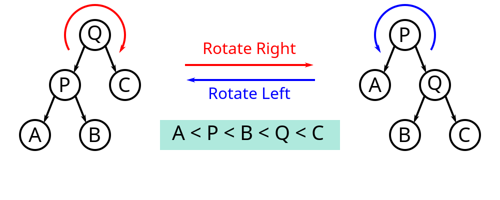

## Treap数据结构原理

[具体代码试下](Treap.cpp)

### 01 二叉树的旋转操作

二叉树的旋转操作是一种可以保证中序遍历不变的情况下，将某个节点上移或者下移的操作。

基本操作有右旋(zig)和左旋(zag)两种。

在旋转的过程中，可以看做将根节点向下移了一层，同时将对应的叶子节点向上移了一层。

### 02 Treap

Treap = Tree + Heap

数据结构同时满足二叉搜索书和堆的性质。

每个节点具有两个属性，一个属性是`key`， 另一个属性是`val`。其中

- `key`属性满足二叉搜索树的性质，及左孩子的值严格小于根节点，右孩子的值严格大于根节点。
- `val`属性满足堆的性质，这里大根堆小根堆都可以，以大根堆为例，也就是根节点的`val`大于所有孩子。

这里的`key`是我们需要维护的信息，这里的`val`是在创建节点的时候使用随机函数生成的一个值。

Treap具有如下的性质：

1. 假设所有的随机生成的`val`都不相同，那么这棵树是唯一的。首先我们根据堆的性质，可以找到所有节点中`val`最大的节点，作为根，根据其`key`值可以将所有的剩余节点划分为左右子树两个部分。再递归地创建两个子树。由于每一步选择根的方式是固定的，所以生成的树是唯一的。
2. 如果生成的`val`足够随机的话，可以看到树是高度平衡的状态。

#### 插入操作

Treap的插入操作比较简单，分为两个部分。

1. 按照`key`属性，依据二叉搜索树的方法来找到插入的位置，如果插入了一个新的节点，则为其随机生成一个`val`值。
2. 插入了新节点之后，虽然整棵树的`key`满足BST的性质，但是`val`不一定满足堆的性质。这个时候可以通过堆的操作来对整棵树进行调整。在堆的操作中，插入新节点之后，通过对这个节点到根节点的路径进行调整来使其满足堆的性质。这里也是一样的方法，不过在堆的操作中发现父节点小于叶子节点，是直接交换两个节点。这里是通过旋转操作来实现交换的目的。在进行回溯的时候，如果发现孩子节点的`val`比自己的`val`要大，如果是左孩子，则进行zig，否则进行zag。不难证明旋转操作也同时保证了堆的性质。这样通过不断地旋转，就可以将整棵树调整到满足堆的性质。

#### 删除操作

Treap的删除操作如下：

1. 当删除的节点是根节点时，直接删除即可，整棵树的两个性质都可以满足
2. 当删除的节点不是根节点时，首先利用旋转操作将要删除的节点旋转到叶子节点的位置，然后直接将其删除。每次旋转的时候，找到孩子中`val`较大的，将其旋转到自己的位置。然后递归调用即可。

#### 根据排名查找值

在每个节点中维护以当前节点为根的子树中的值的个数，然后从根节点进行递归查找：

1. 如果左孩子的个数不小于rank，则从左孩子中查找
2. 如果左孩子的个数加上当前节点中的个数小于rank，则从右孩子中查找
3. 直接返回当前节点的val

#### 根据值查排名

和上面是一个思路。

1. 如果当前节点的`key`和要查找的相同，则返回左孩子的个数 + 1
2. 如果当前节点的`key`比要查找的大，则返回从左孩子中查找的结果
3. 如果当前节点的`key`比要查找的小，则返回从右孩子中查找的结果 + 左孩子的个数 + 当前节点的个数。

#### 找前驱

递归查找。

1. 当查找到空节点时，直接返回-INF。
2. 如果当前节点的key小于等于要查找的，则前驱不可能出现在左孩子，此时返回右孩子查找的结果和当前节点key的最大值
3. 否则的话，说明前驱必然存在左孩子中，直接返回左孩子的查询结果。

#### 找后继

和找前驱相同的思路，

1. 当查找到空节点时，直接返回INF。
2. 如果当前节点的key大于等于要找的，则后继不可能出现在右孩子，返回左孩子查找的结果和当前节点key的最小值。
3. 否则的话，说明后继必然存在右孩子中，直接返回右孩子的查询结果即可。

