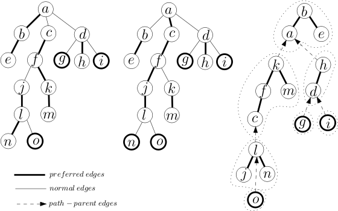

### 动态树

动态树是一个动态维护森林的数据结构。

先考察如何表示一棵树。当然你可以像存图一样存储。动态树的存储方式是：

1. 在树中选择一个节点作为根节点(根节点可以改变)
2. 从根节点开始，选择一条主链。
3. 其他的树都相当于通过一个虚边挂到其他链上。

这里的挂，是指子树可以看到挂到的节点，但是被挂的链看不到它的存在。

不难看出，任意一棵树，都可以由这些链来表示。如下图所示：



对于第一个图，可以把`ade`看做一个主链，然后`cfkm`通过结点`a`挂了上去，`dh`通过结点`a`挂了上去。

`jln`通过结点`f`挂到了链`cfkm`上。

所以我们只需要维护好每一个链的父子关系，然后再维护好这些链之间的`挂`的关系，就可以将整棵树表示出来。

那么如何来维护呢。Splay。

每一个链用一个Splay来维护。Splay的中序遍历是一个链从上到下的顺序。这样就维护好了每个链中的父子关系。

如何维护这种挂的关系呢？Splay的根节点的父节点一般是定义为空，这里我们可以将根节点的父节点置为其挂的节点。注意，这里的Splay的根节点不一定是挂上去的点，任意一点都行，因为这个链的父子关系我们已经完全知道了。这点要理清楚。

这样我们就相当于用一堆Splay维护了一个森林。通过各个Splay的这种挂的关系，可以恢复出每棵树的形态。

动态树支持如下的几种操作：

#### 建立一个从x到根节点的链作为主链

这个函数是动态树所有操作的核心。我们自顶向下来进行操作。如上图。我们从`l`节点出发，向上不断地将Splay分裂，拼接。具体代码如下，从代码中理解。

```c++
// 判断x是否是其所在链的Splay的根节点
bool isroot(int x) {
    int p = tr[x].p;
    return tr[p].s[0] != x && tr[p].s[1] != x;
}

// 建立一条x所在树的根节点到x的一个链
// 自底向上逐步将多个树拼接起来
// 最后再将x旋转到根节点
void access(int x) {

    int x_bak = x;
    int cur_son = 0;
    
    while (x) {
        splay(x);
        tr[x].s[1] = cur_son;
        pushup(x);
        cur_son = x;
        x = tr[x].p;
    }
    splay(x_bak);
}

// 将x旋转到其所属的Splay的根
void splay(int x) {

    // 先将从根到x的这一条路径上节点的懒标记自上到下逐个向下传
    int tt = 0;
    // 这里的栈不能够用stack，因为splay操作会调用非常多次，用stack会直接超时
    stk[++ tt] = x; 
    int cur = x;
    while (!isroot(cur)) {
        cur = tr[cur].p;
        stk[ ++tt] = cur;
    }
    while (tt) {
        int node = stk[tt --];
        pushdown(node);
    }

    // 然后开始双层旋转操作
    while (!isroot(x)) {

        int y = tr[x].p, z = tr[y].p;
        if (!isroot(y)) {
            if ((tr[y].s[1] == x) ^ (tr[z].s[1] == y)) rotate(x);
            else rotate(y);
        }
        rotate(x);
    }

}
```

#### 换根

换根是我们将任意一个节点x变为根。具体操作过程是:

1. 得到根到x的一个链
2. 将x旋转到Splay的根节点，然后将整颗Splay翻转(懒标记)

```c++
// 将x变为原树的根节点
void makeroot(int x) {
    access(x);
    eval(x);
}
```

这里需要想清楚为什么这样操作是可以的。我们考虑出这个链之外的链。他们就像一个东西挂在主链上，我们将树的主链上下颠倒一下，其实其他链的父子关系并不会发生任何变化。所以这个操作是完全OK的。

#### 查找x所在树的根节点

```c++

// 找到x所在树的根节点
int findroot(int x) {

    access(x); // 这个操作结束之后，x已经是其所在链的Splay的根了
    // 这个地方没有向下传懒标记，是因为下面的splay会将
    // 从左孩子到根的这个路径上的懒标记都向下传
    while (tr[x].s[0]) x = tr[x].s[0];
    splay(x);
    return x;
}
```

####  将x和y之间的链剖出来，用一个Splay来表示

```c++
// 将x和y之间的路径抽出来，用一个splay来进行维护
void split(int x, int y) {

    makeroot(x);
    access(y);

}
```

#### 加边 

```c++
// 如果x和y不联通，则将x和y之间连一条边
void link(int x, int y) {
    makeroot(x);
    if (findroot(y) != x) tr[x].p = y;  // 将x所在的树搭到y所在的树上面
}
```

#### 删边

```c++
void cut(int x, int y) {

    makeroot(x);
    // 这三个条件缺一不可，必须确保xy之间有边，
    // 那么将x转到根节点之后，y是x的后继，就必须满足下面三个条件的所有
    if (findroot(y) == x && tr[y].p == x && !tr[y].s[0]) {  
        tr[x].s[1] = 0;
        tr[y].p = 0;
        pushup(x);
    }
}
```

上述所有代码必须深入理解，方可真正理解动态树的操作。

注意，在Spaly进行旋转的时候，必须保证路径上的懒标记都传下去了。仔细想想为什么。

这里的Splay操作和一般的不一样，因为这个根节点的父节点不再是空的缘故。

[完整代码](动态树.cpp)


致敬Tarjan！
