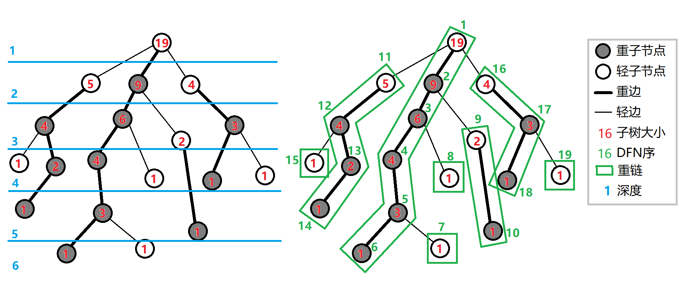

### 树链剖分原理

树链剖分是对树的每个节点按照一定的顺序进行编号，可以保证树上任意两点之间的路径被切分为不超过`log(n)`段子序列。

然后就可以将树上的问题转换成了线性的区间问题。维护区间问题可以使用树状数组、线段树、Splay、分块等数据结构进行操作。

下面是一些概念：

1. 重孩子节点：一颗树的所有孩子中包含节点数最多的孩子。
2. 轻孩子节点：除了重孩子节点之外的节点。
3. 重边：从一个节点到其重孩子节点之间的边。
4. 轻边：除重边之外的边。
5. 重链：重边链接形成的链。

不能看出，一棵树可以分成若干重链，每个重链的最上的一个节点一定是一个轻孩子节点。



下面是对每个节点进行编号的DFS序。

从一个节点开始，优先遍历其重孩子，这样就可以保证一条重链的节点编号是连续的。

同时，对于任意DFS序，一颗子树中的节点的编号都是连续的。

通过两次DFS来建立好需要的数据结构。

第一次遍历求出每个节点的重儿子，父亲，sz、深度等。

第二次遍历优先遍历重儿子，并在运行过程中给每个节点编号即可。

下面是代码模板

```c++
// 第一次DFS
void dfs1(int cur, int father, int de) {
    sz[cur] = 1;
    fa[cur] = father;
    dep[cur] = de;
    for (int i = h[cur]; ~i; i = ne[i]) {
        int node = e[i];
        if (node == father)
            continue;
        dfs1(node, cur, de + 1);
        sz[cur] += sz[node];
        if (sz[node] > sz[son[cur]])
            son[cur] = node;
    }
}

// 第二次DFS
void dfs2(int cur, int t) {
    top[cur] = t;
    ids[cur] = ++cnt;
    nw[cnt] = w[cur];
    if (!son[cur])
        return;
    dfs2(son[cur], t);
    for (int i = h[cur]; ~i; i = ne[i]) {
        int node = e[i];
        if (node == fa[cur] || node == son[cur])
            continue;
        dfs2(node, node);
    }
}
```

经过上面的处理之后，每个节点都在一个重链上，同时得到了每个节点所处的重链的最上面的那个节点`top`数组。

然后再求两个节点之间的路径由哪些段组成的时候，采用一步一步向上爬的方法。每次选择重链顶点高度较低的链加入，这样最终两个节点会相遇到一个重链上。

下面是一些树链剖分的典型应用。

[最近公共祖先](树链剖分_最近公共祖先.cpp)

[树链剖分模板题](树链剖分_模板.cpp)

[树的统计](树链剖分_树的统计.cpp)

[NOI2015 软件包管理器](树链剖分_NOI.cpp)

