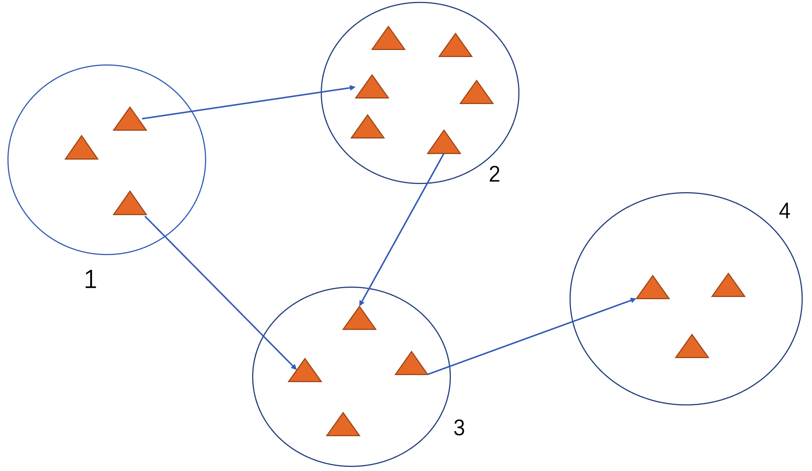
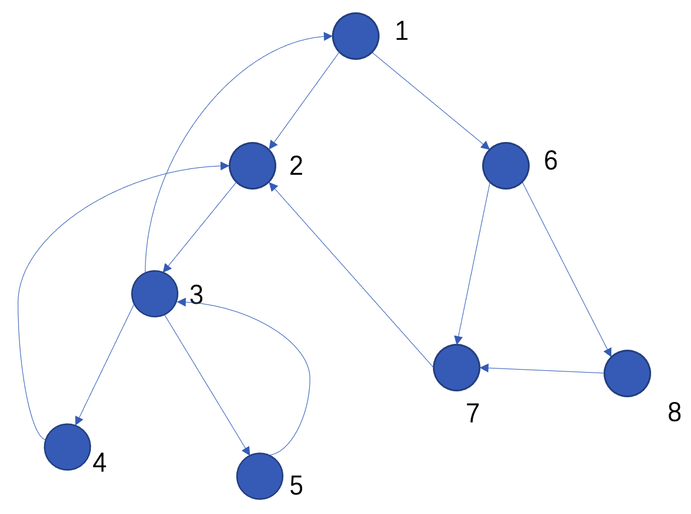

## Tarjan算法求有向图强联通分量

### Tarjan算法的过程

我们首先将整个图看做是一堆强连通分量组成的有向无环图。

任意选择一个点，进行DFS，比如从最左边的联通分量1中随意选择一个点，我们可以观察到如下的事实：

1. 由于是进行DFS，所以第一次回溯的地方，必然是在联通分量4中的一个点。
2. 在执行tarjan算法的时候，给每个节点一个时间戳，那么在一个联通分量中的所有点能够达到的点的时间戳的最小值，就是DFS的时候第一次进入到这个联通分量的点的时间戳。举例来说，就是联通分量4中箭头指向的那个三角形。
3. 在联通分量3道4的这个边进行回溯的时候，联通分量4中的点必定都被遍历到了。

下面观察在一个联通分量内部进行DFS的过程。

首先我们会得到一颗遍历树。

在树中，我们有如下几种边：

1. 树边
2. 前向边
3. 后向边
4. 横边

可以观察到在一个联通分量内部遍历，有如下事实：

1. DFS的第一个链中，必然存在一个节点有一个指向1的反向边。(反证，如果不存在，则不可能在一个联通分量内部)
2. 第一个链的最后一个节点，必然以某种方式和1相连。或者直接有一个指向1的边，或者有一个能够达到1的边。
3. 由于保证遍历过得节点都能够访问到1号节点，所以一旦有一个横叉边，则从根节点到这个节点的路径上的点都可以访问到根。

所以有如下几种情况：

1. 某个点直接连接到了根
2. 某个点通过后向边连接到了当前链能够到达根的节点
3. 某个点通过横叉边连接到了一个可以达到根的节点

定义`lowlink[i]`表示节点`i`及其子树通过反向边能够访问到的最早时间戳以及通过横叉边访问的其它子树能够访问的到最早时间戳。不难观察到，除了根节点外，其它节点的这个时间戳均小于自己的时间戳。

而根节点时间戳就等于自己的`lowlink`，所在在对一个联通分量的所有点遍历之后，到根节点将当前栈顶的所有元素弹出，就是一个联通分量的点。

#### 2. 拓扑序

我们再审视第一个图。一个联通分量之后将其指向的所有联通分量的点都遍历之后，才会回溯到自己，然后将自己的节点弹出栈。所以在使用tarjan算法的时候，联通分量编号的逆序就是求完之后的拓扑序。

如果从中间某个联通分量开始遍历的话，容易证明结论也是成立的。

可以从DFS求DAG拓扑序的过程来进行思考，节点出栈的逆序就是拓扑序。

#### 感受

给我的感觉是，一旦通过一个边进入到一个强连通分量中之后，之后把这个强连通分量内的点全部遍历完之后才可能从进入到自己的那个边回溯。
算法的过程十分神奇。。。

[完整代码](有向图强联通分量.cpp)

