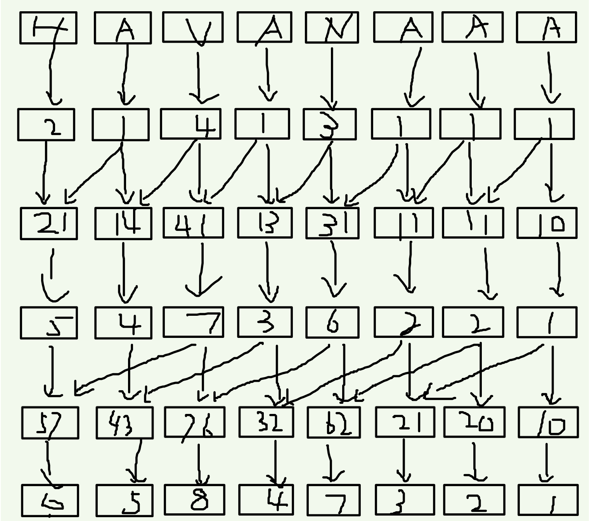

## 后缀数组

### 01 字符串后缀

给定一个长度为$n$的字符串，其一共有`n`个长度不同的后缀。这里规定字符串下标从1开始。

如给定字符串`ababab`，其一共有六个后缀，`ababab`、`babab`、`abab`、`bab`、`ab`、`b`。

每个后缀由其首字符的下表来唯一确定。如1代表`ababab`， 4代表`bab`。

在拿到所有后缀之后，我们希望得到所有后缀的字典序排序结果。

对于上面的例子，排序的结果是：

- `ab`
- `abab`
- `ababab`
- `b`
- `bab`
- `babab`

利用数组`sa`来存储排序结果，`sa[i]`表示排在第`i`位的后缀的下标。`sa`就是字符串的后缀数组那么上面的`sa`数组就是

`[5, 3, 1, 6, 4, 2]`

同时利用数组`rk`来存储每个后缀排序后的编号，`rk[i]`表示第`i`个后缀排序之后的排名。例子的`rk`数组是

`[3, 6, 2, 5, 1, 4]`

可以看到`sa`和`rk`是一个互逆的操作。`rk[sa[i]] = i`， `sa[rk[i]] = i`。所以只需要求出`sa`就可以得到`rk`

### 02 倍增法求后缀数组

一个比较简单的方法是，将所有的后缀取出来，然后进行快排。

后缀的个数是`n`，两个后缀比较的时间复杂度为`O(n)`，所以最终的时间复杂度为$n^2\log(n)$。不是很理想

这里可以使用倍增的方法来进行求解。

假设我们已经知道了字符串中所有长度为$2^k$的子串的排名，(超出的地方补上小于字符集中所有字符的符号)，那么我们可以采用双关键字排序来得到长度为$2^{k + 1}$的子串的排名。

下面是一个比较形象的描述。



采用这样的倍增策略， 最终排序的层数是$\log(n)$，每一层采用快排的话，时间复杂度为$n\log(n)$，所以最终的时间复杂度为$O(n\log^2(n))$

在这里我们发现，在每一层排序的时候，由于关键字的取值是有限的，所以我们可以使用基数排序来在$O(n)$的时间排好。

首先介绍计数排序。

假设我们有如下的数组`[5, 3, 3, 2, 1, 2, 5]`

首先我们创建一个计数数组，统计每个数字出现的次数。

`[0, 1, 2, 2, 0, 2]`

然后求前缀和，得到`[0, 1, 3, 5, 5, 7]`

然后我们就可以得到每个元素的排序后的编号了。逆序扫描原始数组，将其放到其关键字对应的`cnt`数组的对应下下标位置即可。这里的逆序是为了保证关键字相同的时候，排序是稳定的，这一步也是基数排序所必须的。

考察最后一个5，`cnt[5]`是7，所以将5放到新数组的7的位置。并使`cnt[5] --`。这样最终新数组就是排好序的数组。

有了计数排序，可以在其基础上得到基数排序。假设我们现在每个元素有两个关键字,`k1, k2`，`k1`的优先级大于`k2`。我们可以进行如下的操作。

现将所有的按照第二个关键字利用计数排序排好序，然后再按照第一个关键字排序。

在按照第一个关键字排序的时候，第一个关键字不同的元素之间的相对次序是正确的。

第一个关键字相同的元素，由于我们先进行了第二关键字排序，而且计数排序是稳定的，所以他们的相对次序也是正确的。所以最终可以得到正确的结果。

下面是整个过程的代码。`trick`较多，弄明白之后当做黑箱用即可。

```c++
int sa[N], rk[N], x[N], y[N], cnt[N];  // x存储第一关键字，y存储按照第二关键字排好序的结果，cnt用于基数排序的计数
int height[N];

int n, m;
string s;

void get_sa() {
    
    m = 'z';
  	// 设置好初始状态，之间按照每个字符进行计数排序。
    for (int i = 1; i <= n; i ++) cnt[x[i] = s[i]] ++;
    for (int i = 2; i <= m; i ++) cnt[i] += cnt[i - 1];
    for (int i = n; i; i --) sa[cnt[x[i]] --] = i;
    
    // 开始倍增操作
    for (int k = 1; k < n; k <<= 1) {
        
        // 按照第二关键字进行排序
        int num = 0;
        for (int i = n - k + 1; i <= n; i ++) y[++ num] = i;  // 先把第二关键字为零的弄好
        for (int i = 1; i <= n; i ++) {
            if (sa[i] > k) {  // 直接按照第一关键字排好序的结果，从前向后扫描。第`i`个第一关键字是第`i - k`的第二关键字
                y[++ num] = sa[i] - k;
            }
        }
        
        // 在第二关键字排好序的基础上，进行第一关键字排序
        for (int i = 1; i <= m; i ++) cnt[i] = 0;
        for (int i = 1; i <= n; i ++) cnt[x[i]] ++;
        for (int i = 2; i <= m; i ++) cnt[i] += cnt[i - 1];
        
        for (int i = n; i; i --) sa[cnt[x[y[i]]] -- ] = y[i], y[i] = 0;
      
        // 交换两个数组，他们的角色也进行了互换。这里的y已经没用了
        swap(x, y);
        // 重新为每个子串分配关键字，并进行离散化
        x[sa[1]] = 1, num = 1;
        for (int i = 2; i <= n; i ++) {
            x[sa[i]] = (y[sa[i]] == y[sa[i - 1]] && y[sa[i] + k] == y[sa[i - 1] + k]) ? num : ++ num;
        }
        if (num == n) break;  // 已经各不相同，则直接终止
        m = num;
    }
    for (int i = 1; i <= n; i ++) rk[sa[i]] = i;  // 利用sa构造rk
}
```

### 03 LCP

在求完后缀数组之后，我们可以快速求出排序相邻的两个后缀的最长公共前缀。

定义`height[i]`表示`sa[i]`与`sa[i-1]`这两个后缀的最长公共前缀。边界情况`heightt[1] = 0`

对于上面的例子，

- `ab`
- `abab`
- `ababab`
- `b`
- `bab`
- `babab`

通过观察不难得到`height`数组是`[0, 2, 4, 0, 1, 3]`

下面不难发现lcp的几个性质：

1. `sa[i]`和`sa[j]`这两个后缀的最长公共前缀也是`sa[i]`和`sa[k]` 的公共前缀，同时也是`sa[j]`和`sa[k]`的公共前缀，对于任意`k >= i && k <= j`。可以直接使用反证法，注意他们是按照字典序排列的。
2. `sa[i]`和`sa[j]`这两个后缀的最长公共前缀值`ij`之间的`heitht`数组的最小值。
   - 由于这种传递的关系，容易证明这个最小值是他们两个的一个公共前缀。
   - 然后再反证法，证明最长公共前缀不可能大于这个值，如果大于这个值，这两个字符串中间的任意两个字符都有这个长度的相同的前缀，与前面的最小值相矛盾。
   - 有了第二个性质之后，我们就可以使用维护区间最小值的数据结构来高效地得到任意两个后缀的最长公共前缀了。
     - ST表，$O(n\log(n))$构建，$O(1)$查询， $O(n\log(n))$空间
     - 线段树，$O(n)$构建，$O(\log(n))$查询，$O(n)$空间
     - 一般选择ST表，因为求`sa`数组的时间复杂度就已经是$O(n\log(n))$了，所以这里不是时间的瓶颈。

这里再定义一个新的数组`h[i] = height[rk[i]]`，也就是第i个后缀和排序在他前面的那个后缀的LCP。

下面证明`h[i] >= h[i-1] - 1`

分两种情况来证明：

1. 如果`h[i-1] <= 1`，那么显然成立。
2. 如果`h[i-1] > 1`说明`i-1`和它前面的那个有长度大于1的公共前缀，那么我们将他们都抹掉第一个字符，那么`i-1`后缀就变成了`i`后缀，且上面的那个变成了另一个后缀，这两个后缀之间的公共前缀的长度为`h[i-1] - 1`。由于`i`后缀和它前面相邻的最长公共前缀的长度必然不小于`i`和它前面任意一个后缀的最长公共前缀，所以有`h[i] >= h[i-1] - 1`。画个图就懂了。

有了上面的性质，我么可以从小打到枚举`i`，先求最长后缀的答案，然后再其第二长的。然后求`height`数组。

```c++
void get_height() {
    
    int k = 0;
    for (int i = 1; i <= n; i ++) {  // 是按照后缀的编号枚举，不是按照sa数组从前向后枚举
        if (rk[i] == 1) continue;  // 边界情况，直接给0
        if (k) k --; // 利用上面的性质
        int j = sa[rk[i] - 1]; // 拿到排在i前面的那个后缀的编号。
        while (i + k <= n && j + k <= n && s[i + k] == s[j + k]) k ++;  // 开始一个一个向后匹配
        height[rk[i]] = k; // 放到height对应的位置
    }
}
```

时间复杂度：

在每个`for`循环里，每次`k`最多向后走一位，然后再`while`循环里，`k`最多向前前进`n`位，一共最多回退`n`步，然后前进的话最多前进到`n`，所以最多走`3n`步，时间复杂度为`O(n)`

### 04 后缀数组应用

后缀数组一个比较重要的用处是处理子字符串问题。由于任何一个子字符串都是某个后缀的前缀。我们又将所有的后缀都排好了序，二分查找等各种算法就可以上了。

#### 4.1 [查询某个字符串是否出现过](https://codeforces.com/edu/course/2/lesson/2/3/practice/contest/269118/problem/A)

直接在`sa`上进行二分查找。这一步的时间复杂度为$O(|p|\log(n))$，`p`为要查找的字符串的长度。

#### 4.2 [查询某个字符串出现的次数](https://codeforces.com/edu/course/2/lesson/2/3/practice/contest/269118/problem/B)

和上面一样的思路，二分出两个边界，中间元素的个数就是出现的次数

#### 4.3 [查询不同子字符串的个数](https://codeforces.com/edu/course/2/lesson/2/5/practice/contest/269656/problem/A)

从前向后枚举`sa`数组中的没后后缀，考察这个后缀新增的子字符串的个数。由于它和上一个字符串的最长公共前缀已经在上一个字符串中统计了，所以它新增的子字符串个数为`n - sa[i] + 1 - heithg[i]`。

算法的正确性证明也是使用反证法。

逐个枚举即可，这一步的时间复杂度为$O(n)$

#### 4.4[最长重复子串](https://leetcode-cn.com/problems/longest-duplicate-substring/)

求出height数组，然后找到height中元素最大的即可。

#### 4.5 [两个字符串最长公共子串](https://codeforces.com/edu/course/2/lesson/2/5/practice/contest/269656/problem/B)

假设两个字符串分别为`s, t`,则构造一个新的字符串`s + '#' + t`，(这个地方用#因为其ASCII码比数字和英文字母都小)。在这个字符串上跑一遍sa算法，得到了height数组。然后根据`sa[i]`判断相邻两个是否属于s、t不同的串，并找到最大值即可。

可以证明，如果最大的不相邻，也存在一堆相邻的，其公共前缀长度和答案相同！

这个字符串拼接的操作，相当于将两个字符串同时求了后缀数组，并且将他们两个的后缀排序合并了。

如果分开求的话，在合并的话，需要的时间复杂度为$O(n\log n + m\log m + max(n, m)*(n + m))$

合并求的话，时间复杂度为$O((n + m)\log(n + m))$，明显快很多。

#### 4.6 [字符串循环移动问题](https://www.luogu.com.cn/problem/P4051)

将字符串复制一份，然后跑一遍SA，然后SA数组中后缀长度不少于N的选择前N个字符组成的串就是所有的循环移动串，排序也弄好了，也找到最小循环移动的位置了。

#### 参考文献

[洛谷题解](https://www.luogu.com.cn/problem/solution/P3809)

[大佬博客](http://www.yhzq-blog.cc/%E5%90%8E%E7%BC%80%E6%95%B0%E7%BB%84%E7%AE%97%E6%B3%95%E6%80%BB%E7%BB%93/)