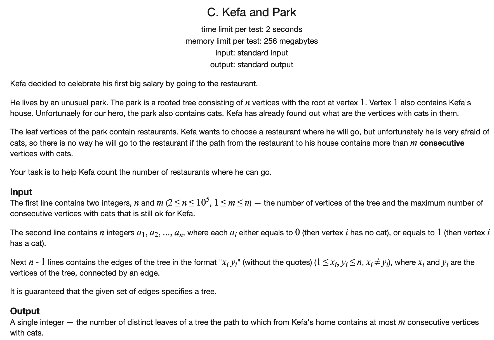
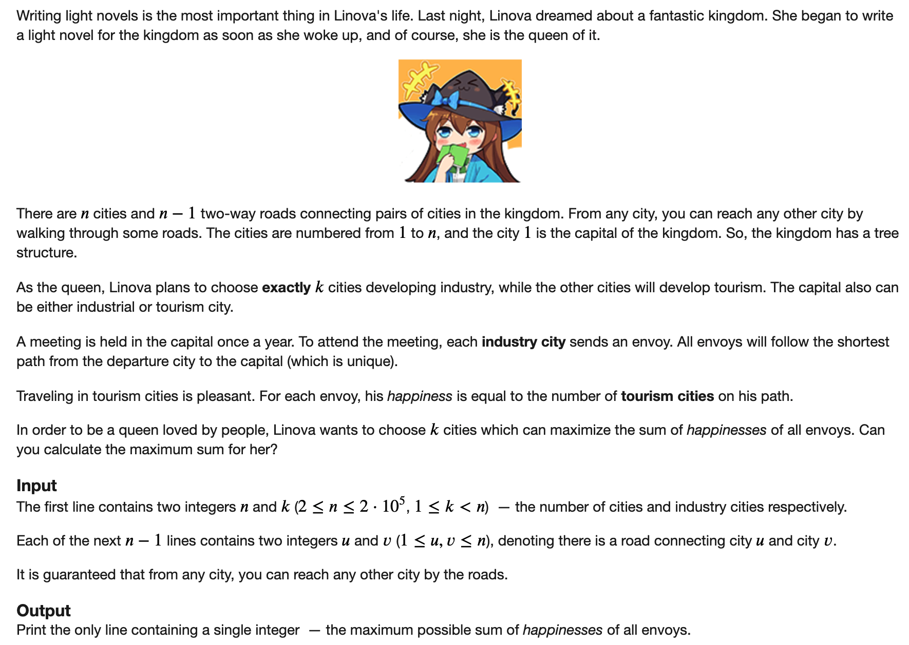

[toc]

### 1. Kefa and Park

[原题链接]()



#### 解题思路

直接dfs即可。在路径上需要记录一下到每个位置的时候，其所在的连续的猫的个数。

#### C++代码

```c++
#include <iostream>
#include <vector>
#include <cstring>
using namespace std;

const int N = 1e5 + 10;
vector<int> edges[N];
bool cat[N];
int n, m;
int ans = 0;
vector<int> path;


void dfs(int cur, int fa) {
    if (edges[cur].size() == 1 && edges[cur][0] == fa) {
        ans ++;
        return;
    }
    for (auto x : edges[cur]) {
        if (x == fa) continue;
        if (cat[x]) {
            if (path.back() + 1 > m) continue;
            else {
                path.push_back(path.back() + 1);
                dfs(x, cur);
                path.pop_back();
            }
        } else {
            path.push_back(0);
            dfs(x, cur);
            path.pop_back();
        }
    }
}

int main() {

    memset(cat, false, sizeof cat);
    cin >> n >> m;
    for (int i = 1; i <= n; i ++) cin >> cat[i];
    for (int i = 0; i < n - 1; i ++) {
        int a, b;
        cin >> a >> b;
        edges[a].push_back(b);
        edges[b].push_back(a);
    }
    path.push_back(cat[1]);
    dfs(1, -1);
    if (m == 0 && cat[1]) {
        cout << 0;
        return 0;
    }
    cout << ans;
    return 0;
}
```

### 2. Linova and Kingdom

[原题链接](https://codeforces.com/problemset/problem/1336/A)



#### 解题思路

每个节点如果称为工业城市，那么他的孩子也都要称为工业城市，可以使用发证法，将孩子弄成工业城市对于快乐值的贡献更大。

每个节点称为工业城市对快乐值带来的增益为(深度 - 孩子个数)。所以可是使用一遍dfs求出每个节点的深度和孩子个数，然后对所有节点的增益求前k个即可。

求前k个不需要排序，只需要使用快速排序的划分函数即可。

#### C++代码

```c++
#include <iostream>
#include <vector>
#include <queue>
#include <algorithm>
using namespace std;

const int N = 2e5 + 10;
int n, k;

vector<int> g[N];
int suns[N], dep[N], fas[N];
vector<int> rec;


int cur_dep;

int dfs1(int cur, int fa) {
    
    cur_dep ++;
    fas[cur] = fa;
    for (auto x : g[cur]) {
        if (x == fa) continue;
        dep[x] = cur_dep;
        suns[cur] += dfs1(x, cur);
    }
    cur_dep --;
    rec.push_back(dep[cur] - suns[cur]);
    return suns[cur] + 1;
}


int main() {
    
    cin >> n >> k;
    while (-- n) {
        int a, b;
        cin >> a >> b;
        g[a].push_back(b);
        g[b].push_back(a);
    }
    
    dfs1(1, -1);
    unsigned long long ans = 0;
    sort(rec.begin(), rec.end());
    reverse(rec.begin(), rec.end());
    for (int i = 0; i < k; i ++) ans += rec[i];
    cout << ans;
    return 0;
}
```

