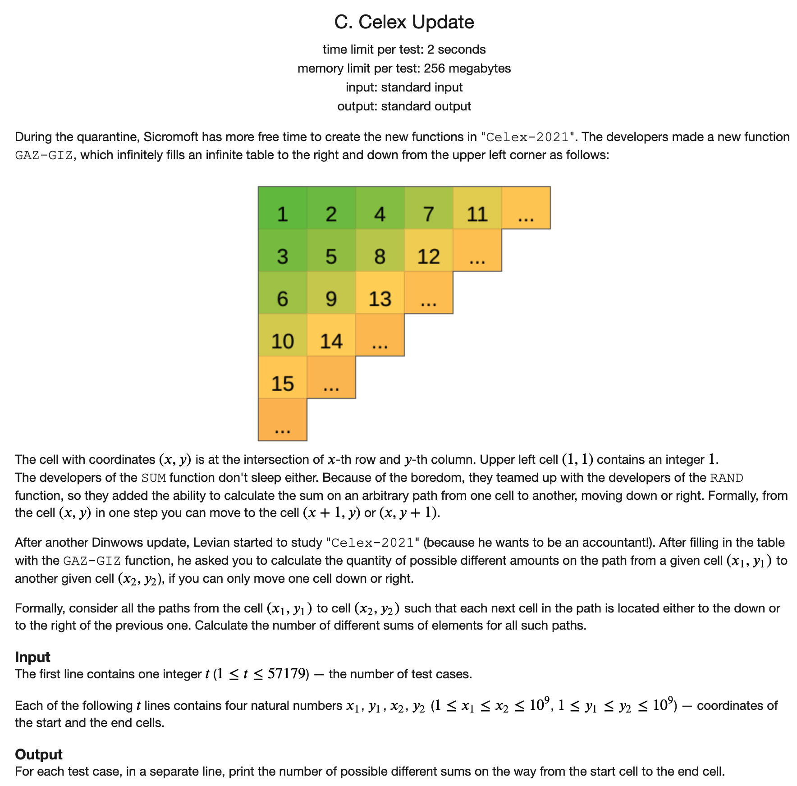
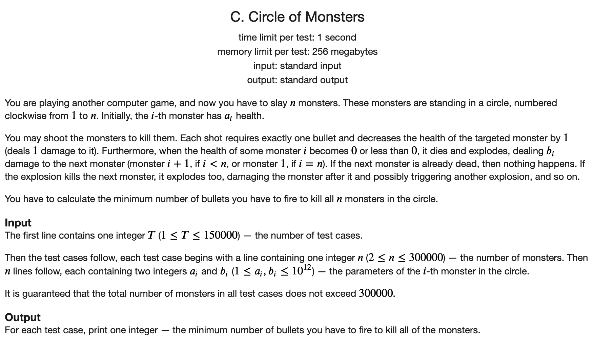
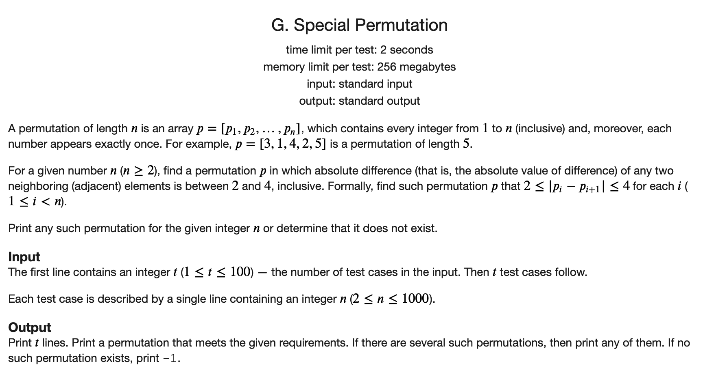
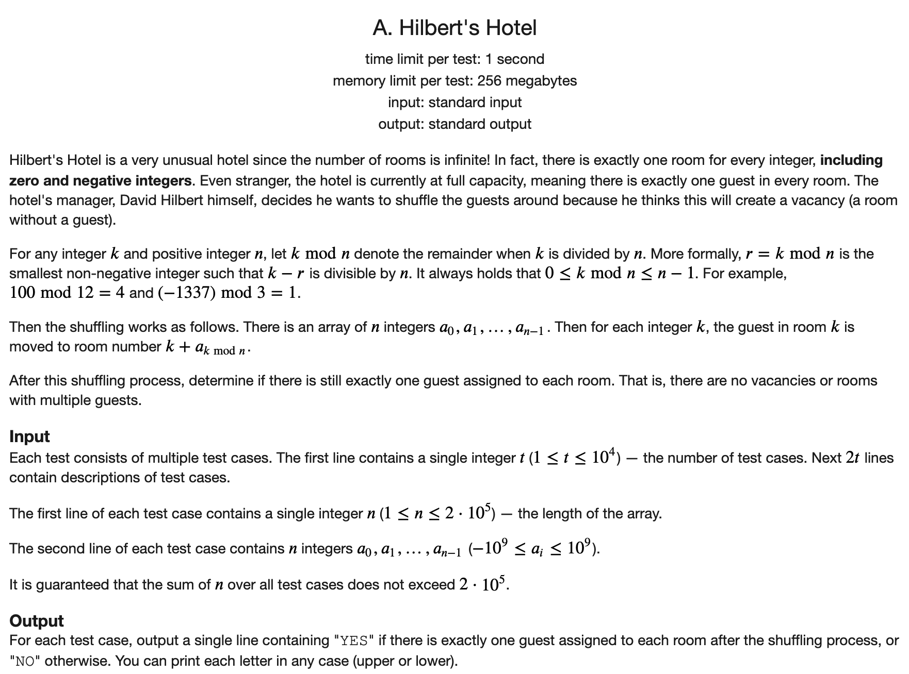
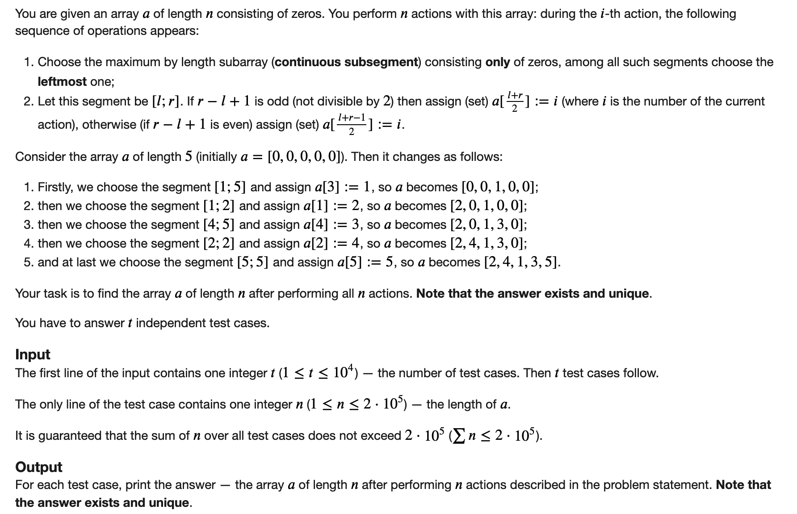
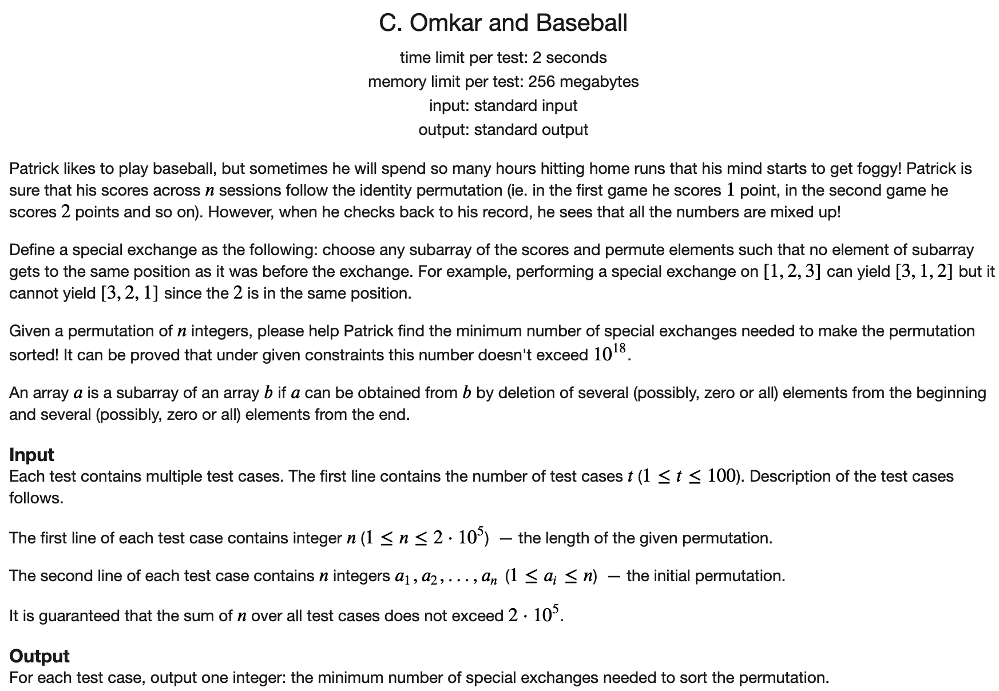
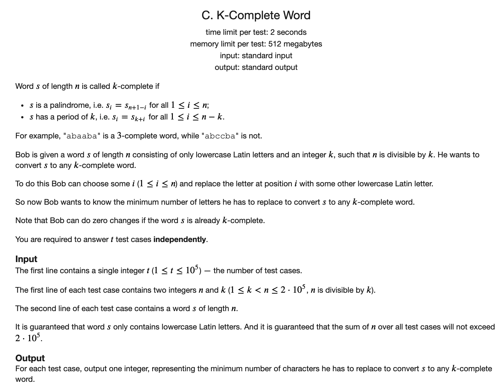
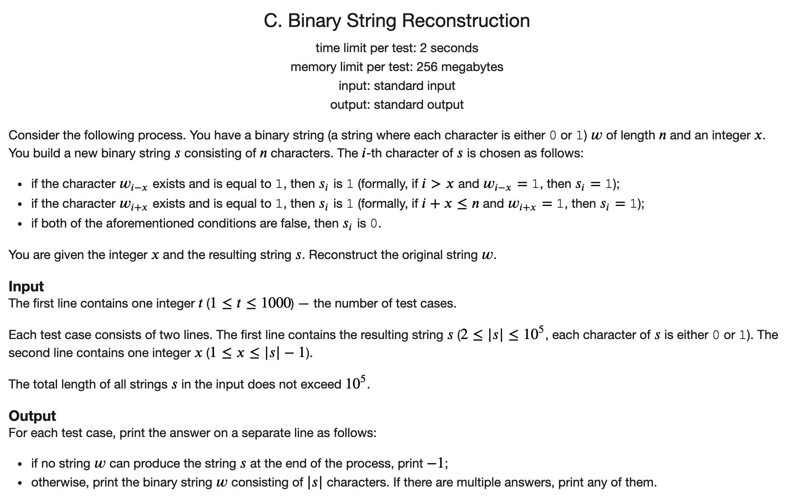
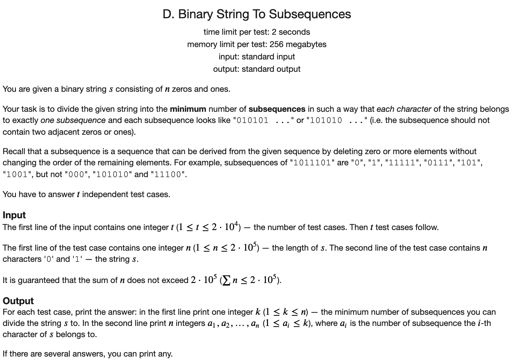
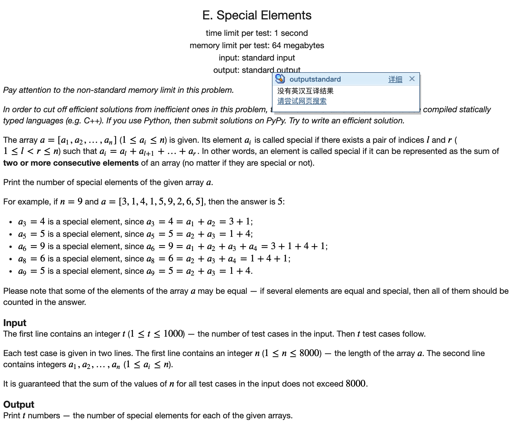

[toc]

### 1.  Powered Addition

[原题链接](https://codeforces.com/problemset/problem/1338/A)


#### 解题思路

由于每次都可以任意选择，所以由二进制表示可知，相当于可以给每个数上加任何一个数。

所以对于每个数而言，其至少要比其左侧比他大的数大。

那么就找到所有这样对的差距，将最大的差距填上了就行了。

#### C++代码

```c++
#include <iostream>
#include <cmath>

using namespace std;

int main() {

    int t;
    cin >> t;
    while (t --) {
        int n;
        cin >> n;
        int _max = -1e9;
        int target = 0;
        int a;
        while (n --) {
            cin >> a;
            target = max(target, max(0, _max - a));
            _max = max(_max, a);
        }
        if (target == 0) cout << 0 << endl;
        else {
           int tmp = log2(target + 1);
           if (pow(2, tmp) == target + 1) cout << tmp << endl;
           else cout << tmp + 1 << endl;
        }
    }
    return 0;
}
```

### 2. Celex Update

[原题链接](https://codeforces.com/problemset/problem/1358/C)



#### 解题思路

观察题。下面 来自官方的题解。先一直向右，再一直向下是最小的走法。先一直向下再一直向右是最大的走法。最大和最小值之间的路径和中间的任意一个和都可以走到。但是求最大和最小，然后相减会爆ULL， 使用`__int128`才行，但是cf评测集不支持。所以只能看答案了。

答案是构造了一种方法，使得找到了一种方式。每次将一个路径的一个右上角变成左下角，就可以使得路径的和增1.这样就得到了所有的方案数为

$$(x2 - x1) * (y2 - y1) + 1$$

#### C++代码

```c++
#include <iostream>
using namespace std;

int main() {

    int t;
    cin >> t;
    while (t --) {
        int x1, y1, x2, y2;
        cin >> x1 >> y1 >> x2 >> y2;
        cout << (unsigned  long long ) (x2 - x1) * (y2 - y1) + 1 << endl;
    }
    return 0;

}
```

### 3. Circle of Monsters

[原题链接](https://codeforces.com/problemset/problem/1334/C)



#### 解题思路

首先第一次肯定是将一个怪物射杀，然后这个怪物会向后进行一些破坏。接下来我们思考，是接着这个破坏的地方继续下去，还是找一个新的怪物干。答案是继续下去。因为如果找一个新的怪物的话，那么就会出现断层，这个断层使得前面的最后受益得不到。

所以最终肯定是选择一个起点，然后一直向后肝下去。那么如何找到需要最小的呢。可以反过来想，因为最终需要将所有的怪物杀掉，所以只需要计算出每个怪物的血量和，然后计算出每个怪物爆炸噪声的真实伤害和，相减即可。由于我们会选择一个作为起点，那么这个起点前面那个点爆炸带来的收益就得不到了，所以只需要找到一个点爆炸带来真实收益最小的点即可。

#### C++代码

```c++
#include <iostream>
using namespace std;
typedef unsigned long long ULL;

const int N = 3e5 + 10;
ULL h[N], b[N];
int t, n;

ULL work() {
    
    ULL sum = 0, dem = 0;
    ULL min_dem = 2e15;
    if (n == 0) return h[0];
    for (int i = 0; i < n; i ++) {
        sum += h[i];
        if (i == n - 1) {
            ULL t = min(b[i], h[0]);
            dem += t;
            min_dem = min(min_dem, t);
        } else {
            ULL t = min(b[i], h[i + 1]);
            dem += t;
            min_dem = min(min_dem, t);
        }
    }
    return sum - dem + min_dem;
    
    
}


int main() {
    std::ios::sync_with_stdio(false);
    std::cin.tie(nullptr);
    cin >> t;
    while (t --) {
        cin >> n;
        for (int i = 0; i < n; i ++) cin >> h[i] >> b[i];
        cout << work() << endl;
    }
    return 0;
}
```

### 4. Special Permutation

[原题链接](https://codeforces.com/problemset/problem/1352/G)



#### 解题思路

想个方法构造即可。先将所有奇数安排了，然后安排所有偶数。

#### C++代码

```c++
#include <iostream>
using namespace std;

int main() {
    
    int t;
    cin >> t;
    while (t --) {
        int n;
        cin >> n;
        if (n < 4) cout << -1 << endl;
        else if (n == 4) cout << "3 1 4 2" << endl;
        else {
            int i = 1;
            for (; i <= n; i += 2) cout << i << " ";
            cout << i - 5 << " ";
            int j;
            if (n & 1) j = n - 1;
            else j = n;
            for (;j >= 2; j -= 2) {
                if (j == i - 5) continue;
                else cout << j << " ";
            }
            cout << endl;
        }
    }
    return 0;
    
}
```

### 5. Hilbert's Hotel

[原题链接](https://codeforces.com/problemset/problem/1344/A)



#### 解题思路

由于具有无限循环周期，所以只需要找到一个周期内的，然后平移之后任然可以铺满`0 ~ n - 1`即可

#### C++代码

```c++
#include <iostream>
#include <cstring>
using namespace std;

const int N = 2e5 + 10;

bool st[N];

int main() {
    
    int t;
    cin >> t;
    while (t --) {
        memset(st, false, sizeof st);
        int n;
        cin >> n;
        bool flag = true;
        int a;
        for (int i = 0; i < n; i ++) {
            cin >> a;
            a = (((a % n) + n) % n + i) % n;
            if (st[a]) flag = false;
            st[a] = true;
        }
        if (flag) cout << "YES" << endl;
        else cout << "NO" << endl;
    }
    return 0;
    
}
```

### 6. Constructing the Array

[原题链接](https://codeforces.com/problemset/problem/1353/D)



#### 解题思路

直接模拟即可。同时使用一个堆来维护下一个要选的区间。注意排序次序。

#### C++代码

```c++
#include <iostream>
#include <queue>
using namespace std;
typedef pair<int, pair<int, int>> PIII;

const int N = 2e5 + 10;
int q[N];

void work(int n) {
    
    priority_queue<PIII> heap;
    heap.push({n,{-1, n}});
    int i = 1;
    while (heap.size()) {
        auto ele = heap.top();
        heap.pop();
        int l = -ele.second.first, r = ele.second.second;
        int mid = l + r >> 1;
        q[mid] = i;
        if (l != mid) heap.push({mid - l,{-l, mid - 1}});
        if (r != mid) heap.push({r - mid, {-(mid + 1), r}});
        i ++;
    }
    
    for (int i = 1; i <= n; i ++) cout << q[i] << " ";
    cout << endl;
    return;
}

int main() {
    
    int t;
    cin >> t;
    while (t --) {
        int n;
        cin >> n;
        work(n);
    }
    return 0;
    
}
```

### 7. Omkar and Baseball

[原题链接](https://codeforces.com/problemset/problem/1372/C)



#### 解题思路

主要是得观察出一个性质，如果一个子序列包含了这个序列中所有数字，而且全部没有在自己的位置上，那么一次就可以放好。

如果一个子序列中有些在自己位置上，有些没有，那么就需要两次，第一次将在正确位置的打乱，第二次再全部复原。

然后看原始序列中有序的将整个序列分成几段即可。

#### C++代码

```c++
#include <iostream>
#include <vector>
using namespace std;
typedef pair<int, int> PII;

const int N = 2e5 + 10;
int q[N];

int main() {
    
    int t;
    cin >> t;
    while (t --) {
        int n;
        cin >> n;
        for (int i = 1; i <= n; i ++) cin >> q[i];
        vector<PII> rec;
        int i = 1;
        int l = -1;
        for (int i = 1; i <= n; i ++) {
            if (q[i] != i) {
                if (l != -1) {
                    rec.push_back({l, i - 1});
                    l = -1;
                }
            } else {
                if (l == -1) l = i;
            }
        }
        if (l != -1) rec.push_back({l, n});
        int ans;
        if (rec.size() == 0) ans = 1;
        else if (rec.size() == 1) {
            if (rec[0].first == 1 && rec[0].second == n) ans = 0;
            else if (rec[0].first == 1 || rec[0].second == n) ans = 1;
            else ans = 2;
        } else if (rec.size() == 2 && rec[0].first == 1 && rec[1].second == n) ans = 1;
        else ans = 2;
        cout << ans << endl;
    }
    return 0;
    
}
```

### 8. K-Complete Word

[原题链接](https://codeforces.com/problemset/problem/1332/C)



#### 解题思路

简单的分析一下，发现只需要将一个长度为`k`的回文串重复成长度为`n`的即可。然后考虑这个字符串每个位置需要是啥。

在考虑每个位置的时候，由于希望改变最少的字符，所以可以统计所有需要是相同的位置的字符，然后令其为出现频率最高的那个即可。

#### C++代码

```c++
#include <iostream>
#include <cstring>
using namespace std;

const int N = 30;
int cnt[30];

int work(string &s, int &k) {
    
    int n = s.size();
    int m = k;
    k = n / k;
    int ans = 0;
    for (int i = 0; i < (m >> 1); i ++) {
        memset(cnt, 0, sizeof cnt);
        for (int j = 0; j < k; j ++) {
            cnt[s[j * m + i] - 'a'] ++;
            cnt[s[j * m + m - 1 - i] - 'a'] ++;
        }
        int _max = 0;
        for (int i = 0; i < 26; i ++) _max = max(_max, cnt[i]);
        ans += 2 * k - _max;
    }
    if (m & 1) {
        int i = m >> 1;
        memset(cnt, 0, sizeof cnt);
        for (int j = 0; j < k; j ++) cnt[s[j * m + i] - 'a'] ++;
        int _max = 0;
        for (int i = 0; i < 26; i ++) _max = max(_max, cnt[i]);
        ans += k - _max;
    }
    return ans;
    
}

int main() {
    
    int t;
    cin >> t;
    while (t --) {
        int n, k;
        cin >> n >> k;
        string s;
        cin >> s;
        cout << work(s, k) << endl;
    }
    return 0;
    
    
}
```

### 9. Binary String Reconstruction

[原题链接](https://codeforces.com/problemset/problem/1400/C)



#### 解题思路

先考虑所有的0，让其左右两侧`x`的都为零。然后检查所有的1是不是符合条件即可。

这里先考察0是因为0可以带来更加准确地信息。如果是1的话，则只能得到一些比较模糊的信息。

#### C++代码

```c++
#include <iostream>
#include <cstring>
using namespace std;

const int N = 1e5 + 10;

int res[N];
bool st[N];

void work(string &s, int &x) {
    
    memset(st, true, sizeof st);
    int n = s.size();
    for (int i = 0; i < n; i ++) {
        if (s[i] == '0') {
            if (i - x >= 0) st[i - x] = false;
            if (i + x < n) st[i + x] = false;
        }
    }
    for (int i = 0; i < n; i ++) {
        if (s[i] == '1') {
            bool st1 = false, st2 = false;
            if (i - x >= 0 && st[i - x]) st1 = true;
            if (i + x < n && st[i + x]) st2 = true;
            if (!(st1 || st2)) {
                cout << -1 << endl;
                return;
            }
        }
    } 
    for (int i = 0; i < n; i ++) cout << st[i];
    cout << endl;
    return ;
    
}

int main() {
    
    int t;
    cin >> t;
    while (t --) {
        string s;
        int x;
        cin >> s >> x;
        work(s, x);
    }
    return 0;
}
```

### 10. Binary String To Subsequences

[原题链接](https://codeforces.com/problemset/problem/1399/D)



#### 解题思路

贪心，维护两个数组记录末尾是零和1的序列的标号，然后遇到之后追加到后面，并放到另外一个队列。如果为空，则新建一个队列。

#### C++代码

```c++
#include <iostream>
#include <vector>
using namespace std;

int main() {
    
    int t;
    cin >> t;
    while (t --) {
        int n;
        cin >> n;
        int ans = 1;
        string s;
        cin >> s;
        vector<int> r0, r1;
        vector<int> rec;
        int cur = 0;
        for (auto x : s) {
            if (x == '0') {
                if (r1.size() == 0) {
                    r0.push_back(++cur);
                    rec.push_back(cur);
                } else {
                    int t = r1.back();
                    r1.pop_back();
                    r0.push_back(t);
                    rec.push_back(t);
                }
            } else {
                if (r0.size() == 0) {
                    r1.push_back(++cur);
                    rec.push_back(cur);
                } else {
                    int t = r0.back();
                    r0.pop_back();
                    r1.push_back(t);
                    rec.push_back(t);
                }
            }
        }
        cout << cur << endl;
        for (auto x : rec) cout << x << " ";
        cout << endl;
    }
    return 0;
}
```

### 11. Special Elements

[原题链接](https://codeforces.com/problemset/problem/1352/E)



#### 解题思路

预处理好所有的子数组的值，然后暴力看就行。

#### C++代码

```c++
#include <iostream>
#include <unordered_set>
#include <cstring>
using namespace std;


const int N = 8010;
int q[N];
int s[N];
bool st[N];

int main() {
    
    int t;
    cin >> t;
    while (t --) {
        memset(st, false, sizeof st);
        int n;
        cin >> n;
        for (int i = 1; i <= n; i ++) {
            cin >> q[i];
            q[i] += q[i - 1];
            for (int j = i - 2; j >= 0; j --) {
                if (q[i] - q[j] > 8000) break;
                st[q[i] - q[j]] = true;
            }
        }
        int ans = 0;
        for (int i = 1; i <= n; i ++) {
            if (st[q[i] - q[i-1]]) ans ++;
        }
        cout << ans << endl;
        
    }
    return 0;
}
```

